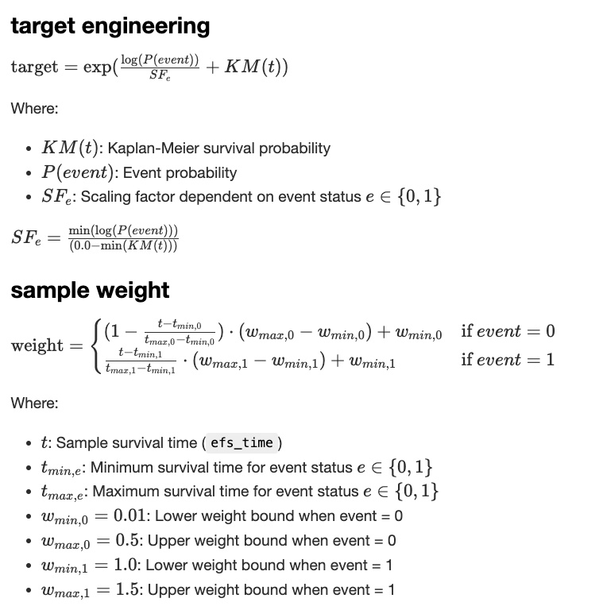

# equity-post-HCT-survival-predictions

## 23th solution

### Main Approach

My solution primarily focused on target engineering and sample weight engineering. For target engineering, I implemented survival probability scaling using OOF predictions from `efs`. I employed both Kaplan-Meier fitter and Cox proportional hazard model to estimate survival probabilities.
For sample weight engineering, I developed custom weights that vary according to `efs` and `efs_time`, along with a half-weight approach that assigns 0.5 when efs=0.
My final submission consisted of seed averaging and stacking ensemble methods.



### efs prediction

- 1st layer
  - Catboost (5 seed averaging)
  - LightGBM (5 seed averaging)
- 2nd layer
  - mean ensemble

### ensemble

- 1st layer (5 seed averaging)
  - Catboost x 7
  - LightGBM x 12
  - XGBoost x 7
  - TabM x 6
- 2nd layer (5 seed averaging)
  - Catboost
  - Ridge
- 3rd layer (5 seed averaging)
  - Ridge

## score

- cv: 0.695
- Public: 0.694
- Private: 0.694

---

## setup

```bash
export KAGGLE_USERNAME={YOUR_KAGGLE_USERNAME}
export KAGGLE_KEY={YOUR_KAGGLE_KEY}
```

```bash
uv sync
```

## download competition dataset

```bash
sh scripts/download_competition.sh
```

## submission flow

1. `experiments` に実験フォルダを作成する

2. 実験を行う

3. 以下のいずれかの方法を使って、サブミッション時に使用するコードやモデルを upload する

- コードの実行

  ```python
  from src.kaggle_utils.customhub import dataset_upload, model_upload

  model_upload(
    handle=config.ARTIFACTS_HANDLE,
    local_model_dir=config.OUTPUT_DIR,
    update=False,
  )
  dataset_upload(
    handle=config.CODES_HANDLE,
    local_dataset_dir=config.ROOT_DIR,
    update=True,
  )
  ```

- スクリプトの実行

  ```bash
  sh scripts/push_experiment.sh 001
  ```

4. 必要な dependencies を push する

   ```sh
   sh scripts/push_deps.sh
   ```

5. submission

   ```sh
   sh scripts/push_sub.sh
   ```

## lint & format

```bash
uv run pre-commit run -a
```

## Reference

- [効率的なコードコンペティションの作業フロー](https://ho.lc/blog/kaggle_code_submission/)
- [Kaggle コンペ用の VScode 拡張を開発した](https://ho.lc/blog/vscode_kaggle_extension/)
